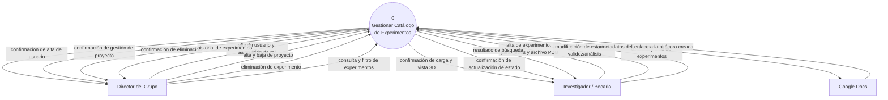
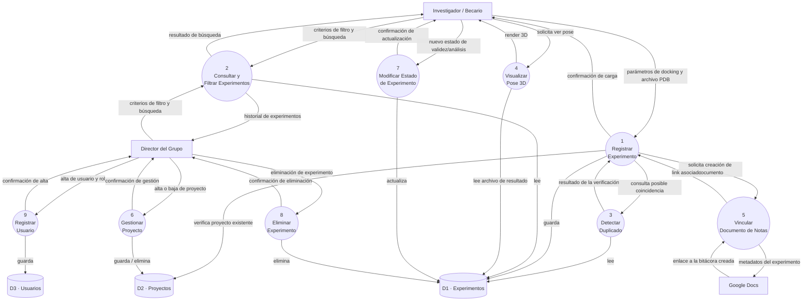
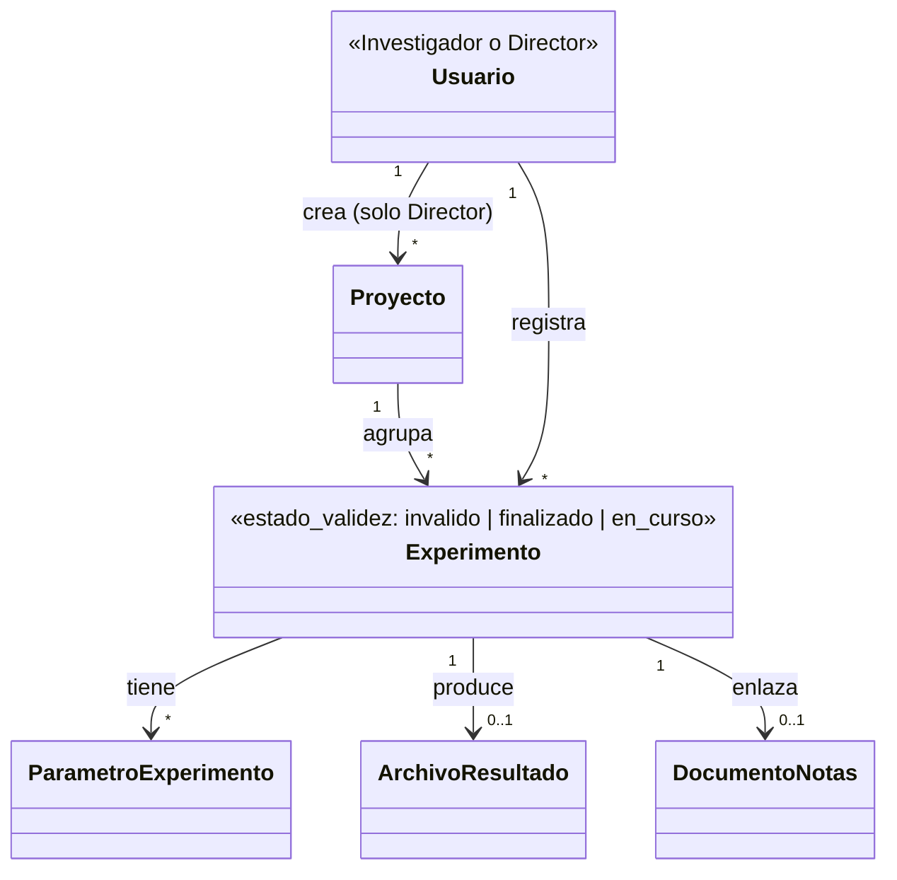

# **Canvas de Descubrimiento**

### **Dominio y Problema**
En un grupo de investigacion pequeño (ej. un lab de facultad) que corre experimentos computacionales: docking molecular, MD, ensamblados genomicos. Los registros de lo que se probó, sus parámetros y los resultados queda disperso en diversas carpetas locales, con nombres de archivos poco descriptivos y comunicación informal entre pares. Hoy esto se resuelve (mal) con planillas sueltas o memoria de quien hizo cada cosa. Esto tiene como consecuencia que se suelen repetir ensayos ya hechos, y para revisar un resultado hay que descargar el archivo y abrir un programa para su visualización.

### **Datos**
Metadatos estructurados por experimento: tipo, parámetros de entrada, fecha, autor, hipótesis, resultado/estado. Para el MVP (docking), además el archivo de resultado en formato PDB (estructura de la pose obtenida) para el visor de solo lectura. Los datos son generados por los propios integrantes del grupo por lo que no dependen de ninguna fuente ni API externa para funcionar.

### **Usuarios y Stakeholders**
Investigador/estudiante: cargan experimentos nuevos, buscan si algo similar ya se probó antes de correrlo.
Director/responsable del grupo: consulta el historial completo para tener panorama del avance sin pedirle a cada integrante que le comente absolutamente todo.
No usuario directo pero interesado: la cátedra/docente, en tanto es quien evalúa el proyecto,no interactúa con el sistema en producción. 

### **Valor**
Si el sistema funciona, nadie repite un experimento ya realizado sin saberlo, no hace falta abrir software externo (VMD, PyMOL, etc) solo para mirar el resultado, y por ultimo, el proyecto queda consultable para cualquier duda y para un integrante que se suma al grupo posteriormente.

### **Alcance Realista**
*Adentro del sistema*
* Alta, consulta y filtro de experimentos de un solo tipo: docking.
* Campos: molécula/proteína, ligando, software usado, parámetros clave, sitio activo, autor, fecha, hipótesis, estado (éxito/fallido/en curso).
* campo de notas simple por experimento, de un solo autor por vez, dentro del propio sistema.
* Detección de posible duplicado (mismo tipo + misma molécula/ligando ya cargado antes).
* Visor 3D de solo lectura de la pose resultante (vía 3Dmol.js u otra librería equivalente), sin cálculo ni análisis adicional.
* Vínculo con Google Docs: crear/asociar un documento de notas por experimento.

*Afuera del sistema*
* Dinámica molecular y BLAST/ensamblados. --> Quedan como extensión futura, no en esta entrega.
* Reproducción de trayectorias completas de MD (múltiples frames). --> Solo pose estática.
* Cualquier análisis, cálculo o edición sobre los resultados dentro del sistema. --> Es visualización pura.
* Edición colaborativa en tiempo real de las notas dentro del sistema, eso vive en Google Docs, el sistema solo enlaza/crea.

### **Riesgos de Fracaso** 
El más probable en nuestro caso es el cambio de requerimientos. Si el modelo de datos de docking queda armado con columnas fijas muy específicas de esa técnica, agregar otra técnica después obliga a rehacer el esquema. 
* Mitigación: diseñar la tabla de "parámetros del experimento" como estructura extensible (ej. clave-valor o JSON) en vez de columnas rígidas por técnica, para que sumar dinámica molecular más adelante sea agregar filas de parámetros nuevos, no rediseñar la base.

### **Datos Sensibles**
Los metadatos de experimentos no son datos clínicos ni biológicos de una persona — son datos de investigación (moléculas, parámetros, resultados). El único dato mínimamente personal es el nombre del autor de cada experimento (miembro del propio grupo), que no cae dentro de las categorías que exige proteger el Código de Ética IEEE/ACM (no es dato de salud, no es identificable de un tercero ajeno al proyecto).

# **DFD nivel 0**

# **Descompisición funcional (DFD nivel 1)**

Los 16 flujos externos del Nivel 0 están todos presentes acá, repartidos entre los nueve procesos — regla de balanceo.

# **Modelo de Dominio Conceptual**

# **Selección de proceso(s) a desarrollar en profundidad**

Se elige **Proceso 1 · Registrar Experimento** (incluyendo su interacción con el Proceso 3 · Detectar Duplicado). Tambien el **Proceso 2. Consulta y Filtro de experimentos**. Consideramos que estos procesos son la base para la visualización mínima de lo que el sistema busca hacer, mostrando el uso básico para el usuario investigador / becario, que será el tipo de usuario mas frecuente.

**Quedan fuera de profundización esta entrega:**
- Proceso 4 (Visualizar Pose 3D): la complejidad la resuelve una librería externa (3Dmol.js).
- Proceso 5 (Vincular Documento de Notas): acoplado al Proceso 1, se documenta como dependencia de su especificación.
- Proceso 6 (Gestionar Proyecto): CRUD simple sin reglas de negocio adicionales — se documenta a nivel de alcance (DFD + modelo de dominio), sin CU propio este cuatrimestre.
- Proceso 7 (Modificar Estado de Experimento): cambio de estado simple; queda como extensión natural de CU-01 a desarrollar en una iteración futura si el tiempo lo permite.
- Proceso 8 (Eliminar Experimento): operación de baja sin lógica compleja, análoga a Proceso 6.
- Proceso 9 (Registrar Usuario): alta simple con asignación de rol, sin reglas de negocio propias más allá de la validación de datos básicos — se documenta a nivel de alcance, sin CU propio este cuatrimestre.

# **Requerimientos funcionales**
## Requerimientos funcionales

RF-01: El sistema debe permitir a un usuario con rol Investigador/a registrar un experimento de docking dentro de un proyecto existente, con los campos: molécula/proteína, ligando, software usado, parámetros clave, sitio activo, hipótesis, notas (vacías por defecto) y estado.

RF-02: El sistema debe registrar automáticamente el autor, la fecha y la hora del experimento al momento de la carga, sin intervención manual del usuario.

RF-03: El sistema debe verificar, antes de confirmar el registro, si existe un experimento previo con el mismo tipo y la misma combinación molécula/ligando, excluyendo de esta verificación los experimentos marcados con estado de validez "inválido".

RF-04: El sistema debe alertar al usuario si detecta una posible coincidencia, mostrando el experimento existente, y permitirle decidir si continúa o cancela el registro.

RF-05: El sistema debe crear y asociar automáticamente un documento de Google Docs de notas al confirmarse el registro de un experimento.

RF-06: El sistema debe permitir consultar el detalle completo de un experimento (todos sus campos, parámetros, resultado principal, estado de validez, estado de análisis).

RF-07: El sistema debe permitir filtrar y buscar experimentos por fecha, autor y proyecto.

# **Stakeholders y roles**
## 2. Stakeholders y roles

| Rol | Tipo | Interacción con el sistema | Permisos |
|---|---|---|---|
| Investigador/a o becario/a | Usuario directo | Carga experimentos de docking, consulta el catálogo antes de correr un ensayo nuevo, visualiza poses 3D, agrega notas |Registra experimentos dentro de un proyecto existente; edita los campos de los experimentos que él/ella cargó; puede modificar el estado de validez (`invalido`/`finalizado`) de **cualquier** experimento del catálogo, no solo el propio; consulta y filtra sobre todo el catálogo. No puede crear ni eliminar proyectos ni experimentos.|
| Director/a del grupo | Usuario directo | Consulta el historial completo del grupo, filtra y busca sin necesidad de pedir el dato a cada integrante | Todo lo anterior, más: crea y elimina proyectos; elimina cualquier experimento del catálogo. |
| Cátedra/docente | Interesado, no usuario | Evalúa el proyecto en las instancias de presentación; no interactúa con el sistema en producción | No aplica — no opera el sistema |

**Nota sobre el diseño de permisos**: la distinción de roles entre investigador/a y director/a evita que la carga de un integrante sea modificada o eliminada por otro sin autorización, preservando la trazabilidad histórica que es el valor central del sistema. Ver bloque "Valor" en la sección 1.

# **CU-01 * Cargar archivo de experimento (Proceso 1)**
´´´
Actor principal: Investigador/a
Realiza: RF-01, RF-02, RF-03

Interesados e intereses:
  - Investigador/a: cargar sus datos rápido y saber si están en condiciones de analizarse.
  - Administrador/a del sistema: que no se acepten datos que comprometan el repositorio.

Precondición: el/la investigador/a está autenticado/a y tiene un archivo en su equipo.
Disparador: el/la investigador/a decide cargar un nuevo conjunto de datos.
Garantía de éxito: el archivo queda almacenado, validado, disponible para análisis,
  y el investigador/a tiene un resumen de lo cargado.
Garantía mínima: el sistema nunca deja datos parcialmente almacenados ni corrompe
  el repositorio.

Flujo principal:
  1. El/la investigador/a selecciona el archivo a cargar.
  2. El sistema valida que el formato sea uno de los soportados (CSV, JSON).
  3. El sistema valida que los datos cumplan los rangos y tipos del esquema.
  4. El sistema almacena el archivo validado en el repositorio.
  5. El sistema calcula un resumen estadístico del conjunto de datos.
  6. El sistema confirma la carga exitosa y muestra el resumen.

Flujos alternativos (nombrados):
  - A1: el archivo tiene formato inválido (diverge en el paso 2).
  - A2: el archivo está vacío o sin registros (diverge en el paso 2).
  - A3: el investigador/a cancela antes de confirmar (diverge en el paso 1).

Flujos de excepción (nombrados):
  - E1: se interrumpe la conexión durante la carga (pasos 1-4).
  - E2: el repositorio no tiene espacio disponible (paso 4).
  ´´´